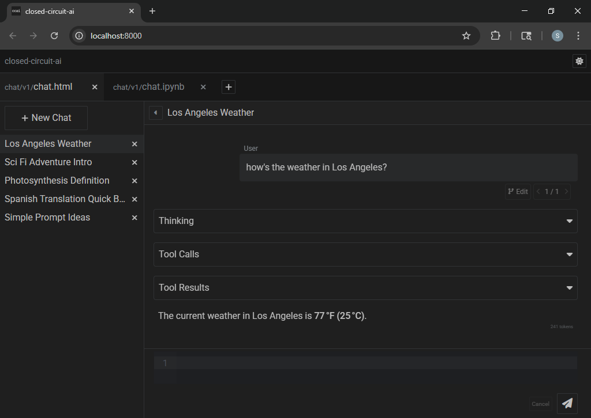
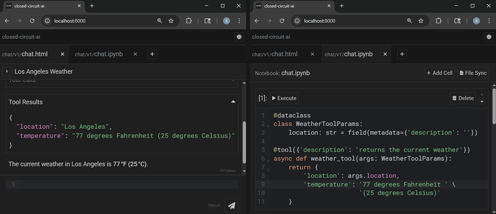
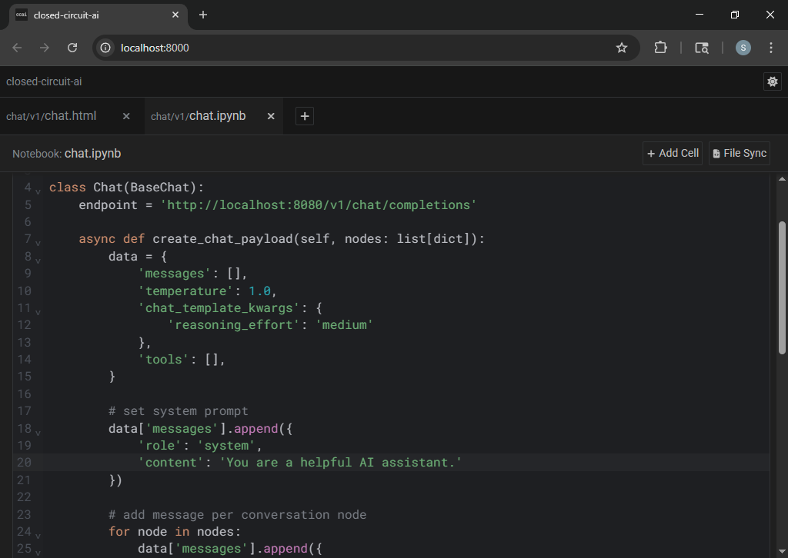

# closed-circuit-ai



---



---



## Summary

* closed-circuit-ai itself is a workspace-driven server for local apps
* it serves local web app front-ends alongside their jupyter notebook back-ends

<!---->

* closed-circuit-ai comes bundled with one native app: **chat** - for working with LLMs
* its notebook (`chat.ipynb`) facilitates user-defined tools and prompt orchestration

<!---->

* ccai and its chat app both utilize conflict-free replicated data types (CRDTs)
* CRDTs offer reliable distributed bidirectional messaging with eventual consistency (partition tolerance)
* thus all fields feature real-time collaborative editing across clients, and offline changes persist

## Prerequisites

* Python (version ≥ 3.10)
* an OpenAI-compatible chat completions endpoint (aka `/v1/chat/completions`)

## Installation

#### Notes

* the total installation size is ~150MB
* the server and the web app combined use ~0.2GB RAM

### Windows (global environment)

```bat
pip install closed-circuit-ai
ccai
```

### Windows (virtual environment)

```bat
cd C:\
python -m venv ccai_env
C:\ccai_env\Scripts\pip install closed-circuit-ai
C:\ccai_env\Scripts\ccai
```

### Linux (virtual environment)

```bash
cd ~
python3 -m venv ccai_env
~/ccai_env/bin/pip install closed-circuit-ai
~/ccai_env/bin/ccai
```

## Usage

```bat
> ccai --help
usage: ccai [PATH]
            [--host HOST]
            [--port PORT]
            [--expose]
            [--ssl-keyfile SSL_KEYFILE]
            [--ssl-certfile SSL_CERTFILE]
            [--overwrite-workspace]
            [--dont-open-browser]
            [--dont-reset-cells]
            [--kernel-connection-file KERNEL_CONNECTION_FILE]
            [--kernel-api-host KERNEL_API_HOST]
            [--kernel-api-port KERNEL_API_PORT]
            [--kernel-api-ssl-keyfile KERNEL_API_SSL_KEYFILE]
            [--kernel-api-ssl-certfile KERNEL_API_SSL_CERTFILE]
```

| options:                    |                                                                                 |
|:----------------------------|:--------------------------------------------------------------------------------|
| `[PATH]`                    | specify the workspace directory - default is `<user-data>/closed-circuit-ai/`   |
| `--host`                    | server listen address - default is `localhost` (aka same-device only)           |
| `--port`                    | server listen port - default is `8000`                                          |
| `--expose`                  | forces `--host 0.0.0.0` (aka accept connections from other devices)             |
| `--ssl-keyfile`             | path to SSL private key                                                         |
| `--ssl-certfile`            | path to SSL public certificate                                                  |
| `--overwrite-workspace`     | overwrite existing workspace files during resource unpacking                    |
| `--dont-open-browser`       | don't automatically open web browser during startup                             |
| `--dont-reset-cells`        | don't automatically clear stale cell execution data (execution_count & outputs) |
| `--kernel-connection-file`  | specify a kernel connection file (to connect to an already-running kernel)      |
| `--kernel-api-host`         | kernel server listen address - default is `localhost`                           |
| `--kernel-api-port`         | kernel server listen port - default is `8100`                                   |
| `--kernel-api-ssl-keyfile`  | path to SSL private key                                                         |
| `--kernel-api-ssl-certfile` | path to SSL public certificate                                                  |

## FAQ

<details>

<summary>Q: how do I connect to ccai from other devices?</summary>

launch `ccai` with the `--expose` flag to accept inbound traffic:

```bat
ccai --expose
```

also, configure your operating system's firewall to allow inbound traffic on your chosen port (default is 8000)

</details>

<details>

<summary>Q: how can I automatically generate tool definitions for my python functions?</summary>

tool definition format varies by model; a default `create_tool_definition` is provided in `chat.py` for gpt-oss

here is an example `chat.ipynb` using dynamic tool registration and execution:

```python
async def create_chat_payload(self, nodes: list[dict]):
    # ...

    # add @tool definitions
    for attr_name in dir(self):
        attr = getattr(self, attr_name)
        if callable(attr) and hasattr(attr, '_metadata'):
            data['tools'].append(self.create_tool_definition(attr))

    return data

async def handle_tool_call(self, tool_call: dict):
    return await self.execute_tool(tool_call)

@dataclass
class WeatherToolParams:
    location: str = field(metadata={'description': 'a location'})

@tool({'description': 'gets the current weather in a given location'})
async def weather_tool(self, args: WeatherToolParams):
    return {
        'location': args.location,
        'temperature': f'77 degrees Fahrenheit (25 degrees Celsius)',
    }
```

</details>

<details>

<summary>Q: how do I set up an OpenAI-compatible chat completions endpoint?</summary>

llama.cpp is recommended; you can find their precompiled releases here: [llama.cpp/releases](https://github.com/ggml-org/llama.cpp/releases)

for example, a Windows user with an nvidia gpu would download and extract `llama-b7000-bin-win-cuda-12.4-x64.zip`

(and: if you don't already have CUDA installed, you should download and extract the `.dll` files from `cudart-llama-bin-win-cuda-12.4-x64.zip` to be adjacent to your `llama-server.exe`)

then run `llama-server.exe` with a configuration appropriate for your hardware and model, for example:

`llama-server.exe --model C:\Users\Sky\Downloads\gpt-oss-20b-F16.gguf --host localhost --port 8080 --threads 6 --ctx-size 32768 --flash-attn on --jinja --n-gpu-layers 24 --n-cpu-moe 24 --ubatch-size 2048 --batch-size 2048 --temp 1.0 --min-p 0.0 --top-p 1.0 --top-k 0.0 --no-mmap --mlock --no-webui`

</details>

<details>

<summary>Q: does this support Ollama or other providers?</summary>

The official `/v1/chat/completions` spec does not support reasoning models, so providers like llama.cpp and Ollama have deviated from the official spec in order to force support, and these deviations are provider-specific. At the time of this writing, Ollama's implementation conflicts with llama.cpp's implementation, so Ollama will not work correctly out-of-the-box. Other providers may have similar incompatibilities. But, it is fairly easy to modify `chat.py` and `chat.ipynb` to support any provider/spec if you are so inclined.

</details>
